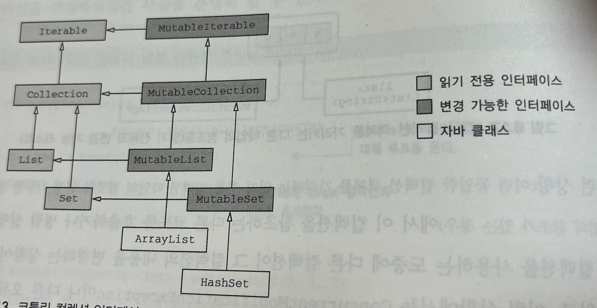

# 6장. 코틀린 타입 시스템

**6장에서 다루는 내용**

- 널이 될 수 있는 타입과 널을 처리하는 구문의 문법
- 코틀린 원시 타입 소개와 자바 타입과 코틀린 원시 타입의 관계
- 코틀린 컬렉션 소개와 자바 컬렉션과 코틀린 컬렉션의 관계

<br>

### 타입 시스템

: 널이 될 수 있는 타입, 읽기 전용 컬렉션, 불필요하거나 문제가 되던 부분을 제거(ex. 배열)

<br>

# 6.1 널 가능성

:NPE 오류를 피할 수 있게 돕기 위한 코틀린 타입 시스템의 특성

```bash
"An error has occurred: java.lang.NullPointerException"
"Unfortunately, the application X has stopped"
```

이러한 문제를 가능한한, 실행시점에서 컴파일 시점으로 옮기려 했다.

: null이 될 수 있는지 여부를 타입 시스템에 추가함으로서 컴파일러가 여러 가지 오류를 컴파일 시 미리 감지해서 실행 시점에 발생할 수 있는 예외 가능성을 줄임

<br>

## 6.1.1 널이 될 수 있는 타입

널이 될 수 있는 타입의 명시적 지원 : 프로퍼티나 변수에 null을 허용하게 만드는 방법

```kotlin
/*
	java
*/
int strLen(String s){
	return s.length();
}

/*
	kotlin
*/

fun strLen(s:String) = s.length //null 불가
fun strLen(s:String?) = s.length //null 가능
```

?가 없으면, null을 인자로 넘길 수 없기때문에 결코 실행시점에 nullPointerrException을 발생시키지 않으리라 장담할 수 있다.

따라서, 모든 타입은 기본적으로 널이 될 수 없는 타입니다.

?가 붙어서 null이 될 수 있는 타입이 되면, 그에 대해 수행할 수 있는 연산이 제한 된다.

- 널이 될 수 있는 타입인 변수에 대해 변수.메소드() 처럼 메소드를 직접 호출할 수가 없다.
- null이 될수 있는 값을 널이 될 수 없는 타입의 변수에 대입할 수 없다.
- 널이 될 수 있는 타입의 값을 널이 될 수 없는 타입의 파라미터를 받는 함수에 전달할 수 없다.

```kotlin
fun strLensafe(s:String?):Int = if(s!=null) s.length else 0 
																		//null 검사를 추가하면 코드가 컴파일 된다.

>>> val x:String? = null
>>> println(StrLenSafe(x))
0
>>>println(strLenSafe("abc"))
3
```

<br><br>

## 6.1.2 타입의 의미

타입: 분류(classification)로, 타입은 어떤 값들이 가능한지와 그 타입에 대해 수행할 수 있는 연산의 종류를 결정한다.

```kotlin
자바에서 이러한 null을 다루는 방법
1. @Nullable, @NotNull : 
2. Optional : 코드가 지저분해지고, 래퍼가 추가됨에 따라 실행시점 성능이 저하되며, 전체 에코시스템에서
일관성있게 활용하기 어렵다. 여전히 JDK메소드나 안드로이드 프레임워크, 다른 서드파티 라이브러리 등에서 반환되는
null을 처리해야 한다.
```

실행 시점에 널이 될 수 있는 타입이나 널이 될 수 없는 타입의 객체는 같다. 널이 될 수 있는 타입은 널이 될 수 없는 타입을 감싼 래퍼 타입이 아니다. 모든 검사는 컴파일 시점에 수행된다. 따라서 코틀린에서는 널이 될 수 있는 타입을 처리하는데 별도의 실행시점에 부가 비용이 들지 않는다.

<br><br>

## 6.1.3 안전한 호출 연산자 : ?.

?. : null 검사와 메소드 호출을 한번의 연산으로 수행한다. :null 이 아니면 메소드가 호출된다. null 이면 null이 결과 값이 된다. 

```kotlin
s?.toUppercase()
if(s!=null) s.toUpperCase() else null //위와 같다. 
```

: 안전한 호출의 결과 타입도 널이 될 수 있는 타입 = String?

안전한 호출 연쇄시키기

```kotlin
class Address(val streetAddress: String, val zipCode: Int,
              val city: String, val country: String)

class Company(val name: String, val address: Address?)

class Person(val name: String, val company: Company?)

fun Person.countryName(): String {
   val country = this.company?.address?.country //연쇄 호출
   return if (country != null) country else "Unknown"
}

fun main(args: Array<String>) {
    val person = Person("Dmitry", null)
    println(person.countryName())
}
```

<br><br>

## 6.1.4 엘비스 연산자: ?:

```kotlin
fun foo(s: String?){ val t:String s?:"" }
```

```kotlin
package com.example.ch06

fun strLenSafe(s: String?): Int = s?.length ?: 0

fun main(args: Array<String>) {
    println(strLenSafe("abc"))
    println(strLenSafe(null))
}

/*
3
0
*/

//위의 address예제
val address = person.company?.address?: "Unknown"
```

```kotlin
class Address(val streetAddress: String, val zipCode: Int,
              val city: String, val country: String)

class Company(val name: String, val address: Address?)

class Person(val name: String, val company: Company?)

fun printShippingLabel(person: Person) {
    val address = person.company?.address
      ?: throw IllegalArgumentException("No address") //우항에 throw도 넣을 수 있음
    with (address) { //address는 null이 아니다. 
        println(streetAddress)
        println("$zipCode $city, $country")
    }
}

fun main(args: Array<String>) {
    val address = Address("Elsestr. 47", 80687, "Munich", "Germany")
    val jetbrains = Company("JetBrains", address)
    val person = Person("Dmitry", jetbrains)
    printShippingLabel(person) //
    printShippingLabel(Person("Alexey", null))
}
```

<br><br>

## 6.1.5 안전한 캐스트: as?

as? : 연산자는 어떤 값을 지정한 타입으로 캐스트한다. 값을 대상 타입으로 변환할 수 없으면 null을 반환한다.

```kotlin
class Person(val firstName: String, val lastName: String) {
   override fun equals(o: Any?): Boolean {
      val otherPerson = o as? Person ?: return false //타입이 일치하지않으면 false리턴

      return otherPerson.firstName == firstName && //안전한 캐스트 후면 타입이 Person이 됨
             otherPerson.lastName == lastName
   }

   override fun hashCode(): Int =
      firstName.hashCode() * 37 + lastName.hashCode()
}

fun main(args: Array<String>) {
    val p1 = Person("Dmitry", "Jemerov")
    val p2 = Person("Dmitry", "Jemerov")
    println(p1 == p2) //equals 메소드 호출
    println(p1.equals(42))

/*
true
false
*/

}
```

<br><br>

## 6.1.6 널 아님 단언: !!

!! : 어떤 값이든 널이 될 수 없는 타입으로 (강제로) 바꿀 수 있다. 

“나는 이 값이 Null이 아님을 잘 알고 있다. 내가 잘못 생각했다면 예외가 발생해도 감수하겠다”

: 실제 null에 대해 !!를 적용하면 NPE가 발생한다. 

```kotlin
fun ignoreNulls(s: String?) {
    val sNotNull: String = s!! //에러지점
    println(sNotNull.length) 
}

fun main(args: Array<String>) {
    ignoreNulls(null)
}

/*
Exception in thread "main" java.lang.NullPointerException
	at com.example.ch06._6_1_6_NotnullAssertionsKt.ignoreNulls(6.1.6_NotnullAssertions.kt:4)
	at com.example.ch06._6_1_6_NotnullAssertionsKt.main(6.1.6_NotnullAssertions.kt:9)
*/
```

언제나 다른 함수에서 널이 아닌 값을 전달 받는 다는 사실이 분명함을 확인할 대, 널 아님 단언문을 사용해서 널 검사를 다시 수행하고 싶지 않을 것이다.

!!을 널에 대해 사용해서 발생하는 예외의 스택 트레이스 에는 어떤 파일의 몇 번째 줄인지에 대한 정보는 들어있지만 어떤 식에서 예외가 발생했는지에 대한 정보는 들어있지 않다. 

어떤 값이 널이었는 지 확실히 하기 위해 여러 !! 단언문을 한줄에 함께 쓰는 일을 피하라

ex)

```kotlin
person.company!!.address!!.country
```

<br><br>

## 6.1.7 let 함수

let : 식을 평가해서 결과가 널인지 검사한 다음에 그 결과를 변수에 넣는 작업, 널이 될 수 있는 값을 널이 아닌 값만 인자로 받는 함수에 넘기는 경우

→ let은 자신의 수신 객체를 인자로 전달받은 람다에게 넘긴다. 

```kotlin
fun sendEmailTo(email: String) {
    println("Sending email to $email")
}

fun main(args: Array<String>) {
    var email: String? = "yole@example.com"
    email?.let { sendEmailTo(it) }
    email = null
    email?.let { sendEmailTo(it) } //null 일 경우 아무일도 일어나지 않는다.
}

/*
Sending email to yole@example.com
*/
```

let도 중첩시켜 처리하면 코드가 복잡해져 알아보기 어렵기 때문에, 그런 경우 일반적인 if를 사용해 모든 값을 한꺼번에 검사하는 편이 낫다.

<br><br>

## 6.1.8 나중에 초기화할 프로퍼티

객체 인스턴스를 일단 생성한 다음에 나중에 초기화하는 프레임워크

ex) 제이유닛에서의 @Before로 어노테이션 된 메소드 안에서 초기화로직을 수행.

코틀린에서는 일반적으로 생성자에서 모든 프로퍼티를 초기화해야한다. 게다가 프로퍼티 타입이 널이 될 수 없는 타입이라면 반드시 널이 아닌 값으로 그 프로퍼티를 초기화 해야 한다.

그런 초기화 값을 제공할 수 없으면 널이 될 수 있는 타입을 사용할 수 밖에 없다. 

```kotlin
class MyService {
    fun performAction(): String = "foo"
}

class MyTest {
    private var myService: MyService? = null

    @Before fun setUp() {
        myService = MyService()
    }

    @Test fun testAction() {
        Assert.assertEquals("foo",
            myService!!.performAction()) //반드시 널 가능성에 신경써야 한다. 널 검사를 넣거나
																				 //!!나 ?를 꼭 써야 한다. 
    }
} //좋지않은 예의 코드: 프로퍼티를 여러번 사용해야 하면 코드가 더 못생겨진다.
```

lateinit : 프로퍼티를 나중에 초기화 할 수 있다. 나중에 초기화하는 프로퍼티는 무조건 var여야 한다.

```kotlin
class MyService {
    fun performAction(): String = "foo"
}

class MyTest {
    private lateinit var myService: MyService //널이 없는 프로퍼티 선언

    @Before fun setUp() {
        myService = MyService()
    }

    @Test fun testAction() {
        Assert.assertEquals("foo",
            myService.performAction()) // 널 검사 필요 없음
    }
}
```

*val 프로퍼티는 final 필드로 컴파일 되며, 생성자 안에서 반드시 초기화해야한다.

lateinit 필드를 초기화 하기 전에 접근하면 아래 에러가 발생한다.

```kotlin
"lateinit property my Service has not benn initialized" //NPE보단 낫다. 정확한 위치를 알 수 있어서 
```

<br><br>

## 6.1.9 널이 될 수 있는 타입 확장

널이 될 수 있는 타입에 대한 확장 함수를 정의하면 null 값을 다루는 강력한 도구로 활용할 수 있다. 

ex) String을 확장한 isEmpty와 isBlank 가 String? 에선 isNullOrEmpty isNullOrBlank

```kotlin
fun verifyUserInput(input: String?) {
    if (input.isNullOrBlank()) { //널이 될 수 있는 타입의 확장함수는 안전한 호출 없이도 호출 가능하다.
        println("Please fill in the required fields")
    }
}

fun main(args: Array<String>) {
    verifyUserInput(" ")
    verifyUserInput(null)
}

/*
Please fill in the required fields
Please fill in the required fields
*/
```

자바에서의 this는 널이 될 수없지만, 코틀린에서의 this는 널이될 수 있다. 

let 함수도 널이 될 수 있는 타입의 값에 대해 호출 할 수 있지만 let이 this가 널인지는 검사하지 않는다.

따라서 let을 사용할 때 수신 객체가 널이 아닌지 검사하고 싶다면 반드시 호출 연산인 ?. 을 사용해야 한다.

```kotlin
val person: Person? = ...
person.let { sendEmailTo(it) } //에러남
persin?.let { sendEmailTo(it) } //에러안남
```

<br><br>

## 6.1.10 타입 파라미터의 널 가능성

코틀린의 T: null이 될 수 있는 타입 =Any?

널이 될 수 없는 타입으로 하려면 타입 상한을 지정해야 한다.

```kotlin
fun <T> printHashCode(t: T) {
    println(t?.hashCode())
}

fun main(args: Array<String>) {
    printHashCode(null)
}
/*
null
*/
```

```kotlin
fun <T:Any> printHashCode(t: T) {
    println(t?.hashCode())
}

fun main(args: Array<String>) {
    printHashCode(null)
}

/*
Kotlin: Null can not be a value of a non-null type TypeVariable(T)
*/
```

<br><br>

## 6.11 널 가능성과 자바

- 어노테이션이 있는 경우

자바의 @Nullable + Type = 코틀린의 Type?

자바의 @NotNull + TYPE = 코틀린의 Type

- 어노테이션이 없는 경우 : 코틀린의 플랫폼 타입

<br>

### 플랫폼 타입

: 코틀린이 널 관련 정보를 알 수 없는 타입

: 널이 될 수 있는 타입, 널이 될 수 없는 타입으로 전부 처리 가능

: 자바와 마찬가지로 플랫폼 타입에 대해 수행하는 모든 연산에 대한 책임은 온전히 여러분에게 있다. 컴파일러는 모든 연산을 허용 한다. 다룰 때 조심해야 한다.

: 플랫폼 타입은 선언 불가. 자바에서 온 코드만 적용됨 String!으로 표시됨 

```kotlin
/*자바*/
public class Person {
    private final String name;

    public Person(String name) {
        this.name = name;
    }

    public String getName() { //널 가능성에 대해 알 수 없음.
        return name;
    }
}

/*코틀린*/
fun yellAtSafe(person: Person) {
		println((person.name.toUpperCase() + "!!!") //toUpperCase가 null을 받을 수 없다는 
																								// 예외발생

    println((person.name ?: "Anyone").toUpperCase() + "!!!") //널 검사 추가
}

fun main(args: Array<String>) {
    yellAtSafe(Person(null))
}
```

**상속**

자바클래스나 인터페이스를 코틀린에서 구현할 경우 널 가능성을 제대로 처리하는 일이 중요하다.

<br><br>

# 6.2 코틀린의 원시 타입

코틀린은 원시 타입과 래퍼타입을 구분하지 않는다.

<br>

## 6.2.1 원시 타입:Int,Boolean등

**자바**

- 원시 타입 : 변수에 값이 직접 들어감
- 참조 타입 : 메모리상의 객체 위치에 들어간다. 참조 타입이 필요할 때, 자바는 원시타입 값을 감싼 래퍼타입을 사용한다.

**코틀린** : 구분 없다. 항상 변수에 값이 들어가는 것은 아니고, 실행 시점에 가장 효율적인 방식으로 표현된다. 

<br>

## 6.2.2 널이 될 수 있는 원시 타입: Int?, Boolean? 등

코틀린에서 널이 될 수 있는 원시 타입을 사용하면 그 타입은 자바의 래퍼 타입으로 컴파일된다.

제네릭 클래스의 경우 래퍼타입을 사용한다.

```kotlin
val listOfInts = listOf(1,2,3) //-> Integer로 이루어진 리스트다.
```

: JVM이 타입 인자로 원시 타입을 허용하지 않기 때문이다. 

<br><br>

## 6.2.3 숫자 변환

코틀린은 한타입의 숫자를 다른 타입의 숫자로 자동 변환하지 않는다. 결과 타입의 숫자 범위가 더 넓은 경우 조차도 자동 변환은 불가능하다. 예를들어 코틀린은 다음 코드를 거부 한다.

```kotlin
val i=1
val l:Long = i //"Error: type mismatch" 컴파일 오류 발생

//직접 변환 메서드 호출해야 함
val l:Long = i.toLong()
```

```kotlin
fun main(args: Array<String>) {
    val x = 1
    val list = listOf(1L, 2L, 3L)
    println(x.toLong() in list) //true
}

// println(x in list)는 에러남. 
```

<br>

### 원시타입 리터럴

코틀린은 소스코드에서 단순한 10진수(정수) 외에 다음과 같은 숫자 리터럴을 허용한다.

- L 접미사가 붙은 Long 타입 리터럴:123L
- 표준 부동 소수점 표기법을 사용한 Double 타입 리터럴 : 0.12, 2.0 , 1.2e10, 1.2e-10
- f나F 접미사가 붙은 Float타입 리터럴 : 123.4f , .456f , 1e3f
- 0x나 0X가 붙은 16진 리터럴: 0xCAFEBABE, 0xbcdL
- 0b나 0B가 붙은 2진 리터럴: 0b000000101
- 코틀린1.1 부터는 숫자 리터럴 중간에 밑줄(_)을 넣을 수 있다(1_234, 1_0000_00000_0000L, 1_000.123_456 등)
- 문자 리터럴의 경우 자바와 마찬가지로 구분을 사용한다. 작은 따옴표 안에 문자를 넣으면 되며, 이스케이프 시퀀스(ex) \t)를 사용할 수도 있다.

<br><br>

## 6.2.4 Any, Any? : 최상위 타입

- 자바의 object와 유사 , Any는 모든 타입의 조상 (서로로 컴파일 됨)
- 자바와 마찬가지로 코틀린에서도 원시 타입 값을 Any 타입의 변수에 대입하면 자동으로 값을 객체로 감싼다.
- toString, equals,hashCode는 Any를 상속한 것
- Object 에만 있는 것: wait, notify 메서드

<br><br>

## 6.2.5 Unit 타입: 코틀린의 void

코틀린의 Unit 타입 : 자바의 void와 같은 역할 : 반환하지 않는 함수의 반환 타입 : 생략 가능

```kotlin
fun f() : Unit {} = fun f() {}
```

자바와 다른 점

- Unit은 타입 인자로 쓸 수 있다. Unit 타입에 속한 값은 단 하나뿐이며, 그 이름도 Unit이다. Unit 타입의 함수는 Unit 값을 묵시적으로 반환 한다. 이 두 특성은 제네릭 파라미터를 반환하는 함수를 오버라이드 하면서 반환 타입으로 Unit을 쓸 때 유용하다.

```kotlin
interface Processor<T>
	fun process():T
}

class NoResultProcessor:Processor<Unit>{//Unit을 반환 하지만 타입지정은 필요 없다. "값 없음"
	override fun process(){
		//업무 처리 코드 
	}   //return 이 필요없다.
}
```

<br><br>

## 6.2.6 Nothing 타입: 이 함수는 결코 정상적으로 끝나지 않는다.

Nothing : 함수가 정상적으로 끝나지 않는 다는 사실을 알려주는 것, 아무값도 포함하지 않는다. 함수의 반환 타입이나 반환 타입으로 쓰일 파라미터로만 쓸 수 있다.

```kotlin
fun fail(message: String): Nothing {
    throw IllegalStateException(message)
}

fun main(args: Array<String>) {
    fail("Error occurred")
}
```

<br><br>

# 6.3 컬렉션과 배열

## 6.3.1 널 가능성과 컬렉션

컬렉션 안에 널 값을 넣을 수 있는 지 여부는 어떤 변수의 값이 널이 될 수 있는지 여부와 마찬가지로 중요하다.

```kotlin
fun readNumbers(reader: BufferedReader): List<Int?> {
    val result = ArrayList<Int?>()
    for (line in reader.lineSequence()) {
        try {
            val number = line.toInt()
            result.add(number)
        }
        catch(e: NumberFormatException) {
            result.add(null) //String.toIntOrNull로도 사용 가능.
        }
    }
    return result
}
```

List<Int?> : 리스트 안의 각 값이 널이 될 수 있다.

List<Int>? : 전체 리스트가 널이 될 수 있다. 

```kotlin
fun addValidNumbers(numbers: List<Int?>) {
    var sumOfValidNumbers = 0
    var invalidNumbers = 0
    for (number in numbers) {
        if (number != null) {
            sumOfValidNumbers += number
        } else {
            invalidNumbers++
        }
    }
    println("Sum of valid numbers: $sumOfValidNumbers")
    println("Invalid numbers: $invalidNumbers")
}

fun main(args: Array<String>) {
    val reader = BufferedReader(StringReader("1\nabc\n42"))
    val numbers = readNumbers(reader)
    addValidNumbers(numbers)
}

/*
Sum of valid numbers: 43
Invalid numbers: 1
*/

val validNumbers = numbers.filterNotNull() //-> 타입이 List<Int> 가 됨
```

<br><br>

## 6.3.2 읽기 전용과 변경 가능한 컬렉션

코틀린에서는 컬렉션 안의 데이터에 접근하는 인터페이스와 컬렉션 안의 데이터를 변경하는 인터페이스를 분리했다. : 자바 컬렉션과 나누는 중요한 특성

- kotlin.collections.Collection : 이터레이션, 크기, 안의 원소 검사, 데이터 읽기 : 이왕이면 이것 사용해라.
    - size
    - iterator()
    - contains()
- kotlin.collections.MutableCollection : 컬렉션의 데이터 수정, 원소 추가, 삭제, 원소 지우기.
    - add()
    - remove()
    - clear()

```kotlin
fun <T> copyElements(source: Collection<T>, //읽기만 한다. 
                     target: MutableCollection<T>) { //변경한다.
    for (item in source) {
        target.add(item)
    }
}

fun main(args: Array<String>) {
    val source: Collection<Int> = arrayListOf(3, 5, 7)
    val target: MutableCollection<Int> = arrayListOf(1)
    copyElements(source, target)
    println(target)
}
```

<br><br>

## 6.3.3 코틀린 컬렉션과 자바

코틀린은 모든 자바 컬렉션 인터페이스 마다 읽기 전용 인터페이스와 변경 가능한 인터페이스라는 두 가지 표현을 제공한다.

기본 구조는 java.util 패키지에 있는 자바 컬렉션 인터페이스의 구조를 그대로 옮겨 놓았다. 추가로 변경 가능한 각 인터페이스는 자신과 대응하는 읽기전용 인터페이스를 확장(상속)한다.

읽기전용 인터페이스에는 컬렉션을 변경할 수 있는 모든 요소가 빠져있다.



컬렉션 생성 함수


Q. setOf, mapOf는 내부에서는 변경 가능한 클래스다. 하지만 미래에는 변할 수 있다. 

***다만 자바로 컬렉션을 보낼 땐, 어떤 타입이든 자바에서는 다 변경할 수 있음을 주의해야 한다.

<br><br>

## 6.3.4 컬렉션을 플랫폼 타입으로 다루기

자바의 컬렉션도 변경 가능성에 대해 알 수 없기때문에 코틀린으로 오면 플랫폼 타입인 컬렉션이 된다.

해당 컬렉션에 대한 타입을 정할 때는 아래내용을 반영해야 한다.

- 컬렉션이 널이 될 수 있는가?
- 컬렉션의 원소가 널이 될 수 있는가?
- 오버라이드하는 메소드가 컬렉션을 변경할 수 있는가?

<br><br>

## 6.3.5 객체의 배열과 원시 타입의 배열

```kotlin
fun main(args: Array<String>) {
    for (i in args.indices) { //범위에 대해 이터레이션 하기위해 확장 함수 사용 
         println("Argument $i is: ${args[i]}") //배열의 원소에 인덱스를 사용해 접근
    }
}
```

코틀린의 배열 : 타입을 받는 클래스. 

<br>

**코틀린에서 배열을 만드는 방법**

- arrayOf 함수에 원소를 넘기면 배열을 만들 수 있다.
- arrayOfNulls 함수에 정수 값을 인자로 넘기면 모든 원소가 null이고 인자로 넘긴 값과 크기가 같은 배열을 마들 수 있다. 물론 원소 타입이 널이 될 수 있는 타입인 경우에만 이 함수를 쓸 수 있다.
- Array 생정자는 배열 크기와 람다를 인자로 받아서 람다를 호출해서 각 배열원소를 초기화 해준다. arrayOf를 쓰지 않고 각 원소가 널이 아닌 배열을 만들어야 하는 경우 이 생성자를 사용한다.

```kotlin
fun main(args: Array<String>) {
    val letters = Array<String>(26) { i -> ('a' + i).toString() }
    println(letters.joinToString(""))
}
```

: 람다는 배열 원소의 인덱스를 인자로 받아서 배열의 해당 위치에 들어갈 원소를 반환한다.

```kotlin
fun main(args: Array<String>) {
    val strings = listOf("a", "b", "c")
    println("%s/%s/%s".format(*strings.toTypedArray()))
}
```

: toTyedArray() : 컬렉션을 배열로 만들기. 

배열 타입의 인자도 항상 객체 타입이기 때문에, 원소 타입 배열을 만들려면 특별한 배열을 사용해야 한다.

: IntArray, ByteArray, CharArray,BooleanArray

<br>

**배열 생성 방법**

- 각 배열 타입의 생성자는 size 인자를 받아서 해당 원시 타입의 디폴트 값(보통은 0)으로 초기화된 size 크기의 배열을 반환한다.
- 팩토리 함수(IntArray를 생성하는 intArrayOf 등)는 여러 값을 가변 인자로 받아서 그런 값이 들어간 배열을 반환 한다.
- (일반 배열과 마찬가지로) 크기와 람다를 인자로 받는 생성자를 사용한다.

```kotlin
var five = IntArray(5)
var fiveTwo = IntArrayOf(0,0,0,0,0)
val fiveThree = IntArray(5) { i -> (i+1) * (i+1) }

var args = arrayOf(1,2,3,4,5) //박싱된 값
var intargs = args.toIntArray() //박싱되지 않은 값
```

코틀린은 컬렉션에 사용할 수 있는 모든 확장함수를 배열에도 제공한다(filter, map 등)

```kotlin
fun main(args: Array<String>) {
    args.forEachIndexed { index, element ->
        println("Argument $index is: $element")
    }
}
```

<br><br>

# 요약

- 코틀린은 널이 될 수 있는 타입을 지원해 NullPointerException 오류를 컴파일 시점에 감지할 수 있다.
- 코틀린의 안전한 호출(?.), 엘비스 연산자(?:), 널 아님 단언(!!), let 함수 등을 사용하면 널이 될 수 있는 타입을 간결한 코드로 다룰 수 있다.
- as? 연산자를 사용하면 값을 다른 타입으로 취급한다.
- 자바에서는 가져온 타입은 코틀린에서 플랫폼 타입으로 취급된다. 개발자는 플랫폼 타입을 널이 될 수 있는 타입으로도, 널이 될 수 없는 타입으로도 사용할 수 있다.
- 코틀린에서는 수를 표현하는 타입(Int 등)이 일반 클래스와 똑같이 생겼고 일반 클래스와 똑같이 동작한다. 하지만 대부분 컴파일러는 숫자 타입을 자바 원시 타입(int 등)으로 컴파일한다.
- 널이 될 수 있는 원시 타입(Int? 등)은 자바의 박싱한 원시 타입에 대응한다.
- Any 타입은 다른 모든 타입의 조상 타입이며, 자바의 Object에 해당한다. Unit은 자바의 void와 비슷하다.
- 정상적으로 끝나지 않는 함수의 반환 타입을 지정할 때 Nothing 타입을 사용한다.
- 코틀린 컬렉션은 표준 자바 컬렉션 클래스를 사용한다. 하지만 코틀린은 자바보다 컬렉션을 더 개선해서 읽기 전용 컬렉션과 변경 가능한 컬렉션을 구별해 제공한다.
- 자바 클래스를 코틀린에서 확장하거나 자바 인터페이스를 코틀린에서 구현하는 경우 메소드파라미터의 널 가능성과 변경 가능성에 대해 깊이 생각해야 한다.
- 코틀린의 Array 클래스는 일반 제네릭 클래스처럼 보인다. 하지만 Array는 자바 배열로 컴파일된다.
- 원시 타입의 배열은 IntArray와 같이 각 타입에 대한 특별한 배열로 표현된다.