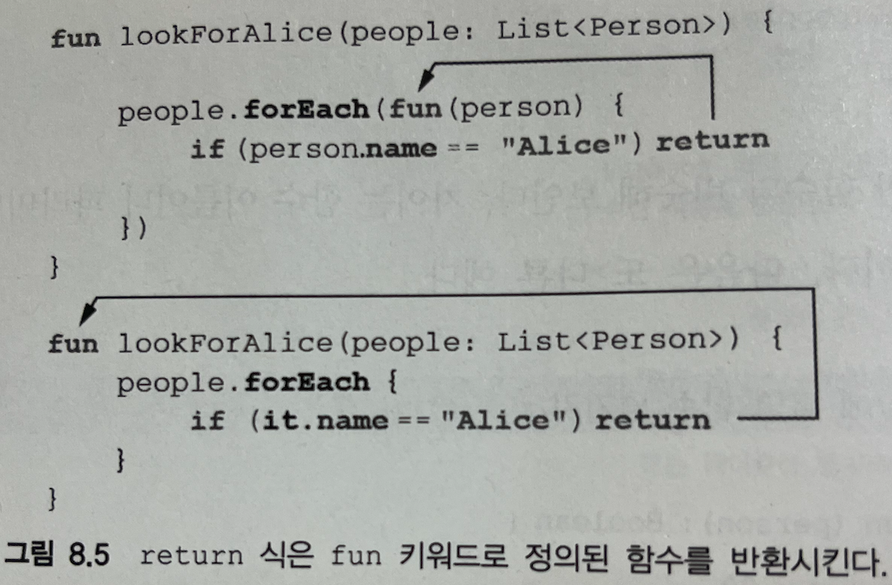

# 8장. 고차 함수: 파라미터와 반환 값으로 람다 사용

8장에서 다루는 내용

- 함수타입
- 고차 함수와 코드를 구조화할 때 고차 함수를 사용하는 방법
- 인라인 함수
- 비로컬 return과 레이블
- 무명 함수

<br>

# 8.1 고차 함수 정의

고차함수: 다른 함수를 인자로 받거나 함수를 반환하는 함수.

코틀린에서는 람다나 함수 참조를 사용해 함수를 값으로 표현할 수 있다. 따라서, 고차함수는 람다나 함수 참조를 인자로 넘길 수 있거나 람다나 함수 참조를 반환하는 함수다.

list.filter{ x > 0 } 

<br>

## 8.1.1 함수 타입

람다를 로컬 변수에 대입 하는 경우

코틀린의 타입 추론으로 인해 변수 타입을 지정하지 않아도 람다를 변수에 대입할 수 있음을 이미 알 것.

```kotlin
//컴파일러가 sum이 함수 타입임을 추론
val sum = {x:Int, y:Int → X+Y} 
val action = {println(42)} 

//각 변수에 구체적인 타입 선언을 추가
val sum: (Int,Int) -> Int = {x,y -> x+y} //int 파라미터를 2개 받아서 int 값을 반환하는 함수
val action:() -> Unit = {println(42)} // 아무런 인자도 받지 않고 아무런 값도 반환하지 않는 함수
var canReturnNull: (Int,Int) -> Int? = {x,y -> null} //반환이 널이 될 수 있는 함수 타입 변수
var funOfNull: ((Int,Int) -> Int)? = null //함수 타입 전체가 널이 될 수 있는 타입

```

코틀린 함수 타입 문법:  (파라미터 타입) → 반환타입 

** 함수 타입을 선언할 땐 Unit도 생략불가

```kotlin
fun performRequest(
       url: String,
       callback: (code: Int, content: String) -> Unit //함수타입의 각 파라미터에 이름 지정
) {
    /*...*/
}

fun main(args: Array<String>) {
    val url = "http://kotl.in"
    performRequest(url) { code, content -> /*...*/ } 
    performRequest(url) { code, page -> /*...*/ } //꼭 안따라도됨
}
```

: 파라미터 이름은 타입 검사 시 무시되어 일치하지 않아도 되지만, 코드 가독성을 좋아지게 해준다.
<br><br>

## 8.1.2 인자로 받는 함수 호출

```kotlin
fun twoAndThree(operation: (Int, Int) -> Int) {
    val result = operation(2, 3)
    println("The result is $result")
}

fun main(args: Array<String>) {
    twoAndThree { a, b -> a + b }
    twoAndThree { a, b -> a * b }
}

/*
The result is 5
The result is 6
*/
```
<br><br>
predicate(술어): boolean을 반환하는 함수, filter 함수는 술어를 파라미터로 받는다.

```kotlin
fun String.filter(predicate: (Char) -> Boolean): String {
    val sb = StringBuilder()
    for (index in 0 until length) {
        val element = get(index)
        if (predicate(element)) sb.append(element)
																				 //predicate 파라미터로 전달받은 함수를 호출한다.
    }
    return sb.toString()
}

fun main(args: Array<String>) {
    println("ab1c".filter { it in 'a'..'z' }) //문자열을 char로 하나씩 넘긴다. 
}

/*
abc
*/
```
<br><br>
## 8.1.3 자바에서 코틀린 함수 타입 사용

```kotlin
/* Kotlin declaration */
fun processTheAnswer(f: (Int) -> Int) {
    println(f(42))
}

/* JAVA */
fun processorTheAnser(number -> number + 1); //자바8 람다를 넘기면 자동으로 함수 타입의 값으로 변환된다. 

/*
43
*/

//자바 8 이전? 우리가 쓸 일 없어보임!

```
<br>
람다를 인자로 받는 확장 함수를 호출해야할 때

: 수신객체를 확장 함수의 첫 번째 인자로 명시적으로 넘겨야 하므로 코틀린에서 확장 함수를 호출할 때 처럼 코드가 말끔하지는 않다. 

```java
/* JAVA */

List<String> strings = new ArrayList();
strings.add("42");
CollectionsKt.forEach(strings, s -> //strings는 확장함수의 수신 객체
																	  //코틀린 표준 라이브러리에서 가져온 함수를 자바 코드에서 호출할 수 있다. 
	   System.out.println(s);
     return Unit.INSTANCE; //Unit 타입의 값을 명시적으로 반환해야 한다.//void를 그냥 리턴할 수 없다. 
}
```
<br><br>
## 8.1.4 디폴트 값을 지정한 함수 타입 파라미터나 널이 될 수 있는 함수 타입 파라미터

```kotlin
fun <T> Collection<T>.joinToString(
        separator: String = ", ",
        prefix: String = "",
        postfix: String = "",
        transform: (T) -> String = { it.toString() } //함수 타입을 선언하면서 람다를 디폴트 값으로 지정
): String {
    val result = StringBuilder(prefix)

    for ((index, element) in this.withIndex()) {
        if (index > 0) result.append(separator)
        result.append(transform(element)) //파라미터로 받은 함수 호출
    }

    result.append(postfix)
    return result.toString()
}

fun main(args: Array<String>) {
    val letters = listOf("Alpha", "Beta")
    println(letters.joinToString()) //디폴트 변환함수사용
    println(letters.joinToString { it.toLowerCase() }) //람다를 인자로 전달
    println(letters.joinToString(separator = "! ", postfix = "! ",
           transform = { it.toUpperCase() })) //이름을 붙혀 전달
}

/*
Alpha, Beta
alpha, beta
ALPHA! BETA!
*/
```

Q. 이 예제가 앞 예제랑 뭐가 다른지..?

```kotlin
fun <T> Collection<T>.joinToString(
        separator: String = ", ",
        prefix: String = "",
        postfix: String = "",
        transform: ((T) -> String)? = null
): String {
    val result = StringBuilder(prefix)

    for ((index, element) in this.withIndex()) {
        if (index > 0) result.append(separator)
        val str = transform?.invoke(element) //Q.. 그럼 인자로 받은 함수가 호출 돼?
            ?: element.toString() //인자로 받은 함수가 없으면 그냥 toString
        result.append(str)
    }

    result.append(postfix)
    return result.toString()
}

fun main(args: Array<String>) {
    val letters = listOf("Alpha", "Beta")
    println(letters.joinToString())
    println(letters.joinToString { it.toLowerCase() })
    println(letters.joinToString(separator = "! ", postfix = "! ",
           transform = { it.toUpperCase() }))
}
```

.invoke

참고 : [https://velog.io/@cgw0519/Kotlin-invoke-함수는-무엇일까](https://velog.io/@cgw0519/Kotlin-invoke-%ED%95%A8%EC%88%98%EB%8A%94-%EB%AC%B4%EC%97%87%EC%9D%BC%EA%B9%8C)
<br><br>

## 8.1.5 함수를 함수에서 반환

사용자가 선택한 배송수단에 따라 배송비를 계산하는 방법이 달라질 때, 적절한 로직을 선택해 함수로 반환하는 예제

```kotlin
enum class Delivery { STANDARD, EXPEDITED }

class Order(val itemCount: Int)

fun getShippingCostCalculator(
        delivery: Delivery): (Order) -> Double { //함수를 반환하는 함수 선언
    if (delivery == Delivery.EXPEDITED) {
        return { order -> 6 + 2.1 * order.itemCount }
    }

    return { order -> 1.2 * order.itemCount } //함수에서 람다를 반환한다. //똑같이 return사용
}

fun main(args: Array<String>) {
    val calculator = //반환받은 함수를 변수에 저장한다. 
        getShippingCostCalculator(Delivery.EXPEDITED)
    println("Shipping costs ${calculator(Order(3))}") //반환받은 함수를 호출한다. 
}

/*
Shipping costs 12.3
*/
```
<br>
연락처 목록을 필터링하고, 이름과 성의 접두사를 검사하고 전화번호가 연락처에있는지도 검사하는 예제.

```kotlin
data class Person(
        val firstName: String,
        val lastName: String,
        val phoneNumber: String?
)

class ContactListFilters {
    var prefix: String = ""
    var onlyWithPhoneNumber: Boolean = false

    fun getPredicate(): (Person) -> Boolean {
        val startsWithPrefix = { p: Person -> //함수를 반환하는 함수를 정의 
            p.firstName.startsWith(prefix) || p.lastName.startsWith(prefix)
        }
        if (!onlyWithPhoneNumber) {
            return startsWithPrefix //함수 타입의 변수를 반환한다. 
        }
        return { startsWithPrefix(it) //람다를 반환한다.
                    && it.phoneNumber != null }
    }
}

fun main(args: Array<String>) {
    val contacts = listOf(Person("Dmitry", "Jemerov", "123-4567"),
                          Person("Svetlana", "Isakova", null))
    val contactListFilters = ContactListFilters()
    with (contactListFilters) { //with: 람다를 실행한 결과를 반환.
        prefix = "Dm"
        onlyWithPhoneNumber = true
    }
    println(contacts.filter( //반환된 함수를 filter의 인자로 넘긴다. 
        contactListFilters.getPredicate()))
}

/*
[Person(firstName=Dmitry, lastName=Jemerov, phoneNumber=123-4567)]
*/
```
<br><br>
## 8.1.6 람다를 활용한 중복 제거

함수 타입과 람다 식은 재활용하기 좋은 코드를 만들 때 쓸 수 있는 훌륭한 도구다.

웹사이트 방문 기록을 분석하는 예제. 

```kotlin
data class SiteVisit(
    val path: String, //방문한 사이트의 경로
    val duration: Double, //사이트에서 머문 시간
    val os: OS //사용자의 운영체제
)

enum class OS {WINDOWS,LINUX,MAC,IOS,ANDROID}

val log=listOf(
    SiteVisit("/", 34.0, OS.WINDOWS),
    SiteVisit("/", 22.0, OS.MAC),
    SiteVisit("/login", 12.0, OS.WINDOWS),
    SiteVisit("/signup", 8.0, OS.IOS),
    SiteVisit("/", 16.3, OS.ANDROID)
)

valaverageWindowsDuration=log
.filter{ it.os == OS.WINDOWS}
.map(SiteVisit::duration)
    .average()

fun main(args: Array<String>) {
println(averageWindowsDuration)
}
```
<br>
1. 윈도우 사용자의 평균 방문 시간을 출력하고 싶을 때. 

```kotlin
fun List<SiteVisit>.averageDurationFor(os: OS) =
        filter { it.os == os }.map(SiteVisit::duration).average()

fun main(args: Array<String>) {
    println(log.averageDurationFor(OS.WINDOWS))
    println(log.averageDurationFor(OS.MAC))
}
```
<br>
1. 모바일 사용자의 평균 방문 시간을 구하고 싶을 때 (필터 하드코딩)

```kotlin
val averageMobileDuration = log
    .filter { it.os in setOf(OS.IOS, OS.ANDROID) }
    .map(SiteVisit::duration)
    .average()

fun main(args: Array<String>) {
    println(averageMobileDuration)
}
```
<br>
1. 고차 함수를 사용해 중복을 제거하고, 다양한 상황에 대한 처리가 가능하도록 변경

```kotlin
fun List<SiteVisit>.averageDurationFor(predicate: (SiteVisit) -> Boolean) =
        filter(predicate).map(SiteVisit::duration).average()

fun main(args: Array<String>) {
    println(log.averageDurationFor {
        it.os in setOf(OS.ANDROID, OS.IOS) })
    println(log.averageDurationFor {
        it.os == OS.IOS && it.path == "/signup" })
}
```
<br>
> 일부 잘 알려진(객체지향) 디자인 패턴을, 함수 타입과 람다 식을 사용해 단순화할 수 있다. 디자인 패턴 중. 전략 패턴을 생각해보자.
람다 식이 없다면 인터페이스를 선언하고 구편 클래스를 통해 전략을 정의해야 한다. 함수 타입을 언어가 지원하면 일반
함수 타입을 사용해 전략을 표현할 수 있고 경우에 따라 다른 람다 식을 넘김으로써 여러 전략을 전달할 수 있다.
> 
<br><br>
# 8.2 인라인 함수: 람다의 부가 비용 없애기

코틀린에서 람다를 함수 인자로 넘기는 구문이 if나 for와 같은 일반 문장과 비슷하다는 사실을 여러분도 눈치 챘을 것이다. ex) with, apply

<aside>
💡 복습타임!!!

</aside>

with : 수신 객체 지정 람다: 수신 객체를 명시하지 않고 람다의 본문 안에서 다른 객체의 메소드를 호출할 수 있게 한다. : 람다를 실행한 결과를 반환

```kotlin
 return with(stringBuilder) { //메소드를 호출하려는 수신 객체를 지정
        for (letter in 'A'..'Z') {
            append(letter) 
        }
        append("\nNow I know the alphabet!") //this생략
        toString() //람다에서 값을 반환
    }
```

apply : with와 거의 유사하지만, apply는 항상 자신에게 전달된 객체(즉 수신객체)를 반환

```kotlin
fun alphabet() = StringBuilder().apply { //확장 함수 형태
    for (letter in 'A'..'Z') {
        append(letter)
    }
    append("\nNow I know the alphabet!")
}.toString()
```
<br><br>
람다를 익명 클래스로 컴파일하지만, 그렇다고 람다 식을 사용할 때마다 새로운 클래스가 만들어지지는 않는다는 사실을 설명했고,

람다가 변수를 포획하면 람다가 생성되는 시점 마다 새로운 익명 클래스 객체가 생긴다는 사실도 설명했다. 이런 경우 실행 시점에 익명 클래스 생성에 따른 부가 비용이 든다. 따라서 람다를 사용하는 구현은 똑같은 작업을 수행하는 일반함수를 사용한 구현보다 덜 효율적이다. 

<aside>
💡 복습타임!!!

</aside>

```kotlin
//익명 클래스가 있는 유일한 추상메소드를 구현할 때 람다 본문을 메소드 본문으로 사용한다.
postponecomputation(1000){println(42)} //컴파일러가 람다를 Runnable로 자동 변환

```
<br>
**람다와 익명 객체 사이의 차이**

: 람다는 Runnable 인스턴스를 변수에 저장하고 메소드를 호출할 때 마다 그 인스턴스를 사용한다.

프로그램 전체에서 Runnable의 인스턴스는 단 하나만 만들어진다. 

람다에 대응하는 익명 객체를 메소드를 호출할 때 마다 반복 사용 한다. 

단, 주변 영역의 변수를 포획한다면 새로운 인스턴스를 생성해준다

```kotlin
fun handlecomputeration(id:String){
	postponecomputation(1000){println(id)}
}
```
<br><br><br>
### inline

어떤 함수에 해당 변경자를 붙이면 컴파일러는 그 함수를 호출하는 모든 문장을 함수 본문에 해당하는 바이트 코드로 바꿔치기 해준다. (반복되는 코드를 별도의 라이브러리 함수로 빼내되 컴파일러가 자바의 일반 명령문만큼 효율적인 코드를 생성하게 만들 수는 없을까?의 답..) 

## 8.2.1 인라이닝이 작동하는 방식

어떤 함수를 inline으로 선언 → 그 함수의 본문이 인라인.

: 함수를 호출하는 코드를 함수를 호출하는 바이트코드 대신에 함수 본문을 번역한 바이트 코드로 컴파일한다는 뜻.

<aside>
💡 인라인이라는 의미는 코드 라인 자체가 안으로 들어간다는 뜻. 즉, 함수의 내용을 호출을 통해서 실행시키는 것이 아니라, 호출하는 코드 자체가 함수 내용의 코드가 되는 효과가 된다는 점이다.

</aside>

출처:

[https://thinkpro.tistory.com/140](https://thinkpro.tistory.com/140)

[THINK-PRO BLOG]

<br><br>
다중 스레드 환경에서 어떤 공유 자원에 대한 동시접근을 막기 위한 예제. 

Lock 객체를 잠그고 주어진 코드 블록을 실행한 다음에 Lock 객체에 대한 잠금을 해제한다.

```kotlin

inline fun <T> syncronized(lock:Lock,action: ()->T):T{ //본문뿐아니라, 전달된 람다의 본문도 함께 인라이닝된다는 점에 유의하라.
																										 //람다 대신에 함수 타입인 변수를 인자로 넘기면 인라이닝 되지않는다.
	lock.lock()
	try {
val temp =fun():String = "Hi"
		return fun():String = "Hi"
    after(temp)
	}
	finally {
		lock.unlock()
	}
}

val l=Lock()
synchronized(l){
 //...
}
```

: 람다의 본문에 의해 만들어지는 바이트 코드는 그 람다를 호출하는 코드(syncronized) 정의의 일부분으로 간주되기 때문에 코틀린 컴파일러는 그 람다를 함수 인터페이스를 구현하는 무명 클래스로 감싸지 않는다.
<br><br>
## 8.2.2 인라인 함수의 한계

그러니까... 

noinline 변경자 : 인라이닝 금지
<br><br>
## 8.2.3 컬렉션 연산 인라이닝

1. filter를 사용해 람다로 컬렉션 거르기.

```kotlin
data class Person(val name: String, val age: Int)

val people = listOf(Person("Alice", 29), Person("Bob", 31))

fun main(args: Array<String>) {
    println(people.filter { it.age < 30 })
}
```
<br>
1. 컬렉션을 직접 거르기

```kotlin
var result = mutableListOf<Person>()
for(people in people){
	if(person.age < 30) result.add(person)
}

println(result)
```

코틀린에 filter는 인라인 함수라, 람다 본문의 바이트 코드와 함께 filter를 호출한 위치에 들어가기 때문에 위 아래는 거의 같다.
<br>
1. filter와 map을 연쇄해서 사용한 예제

```kotlin
data class Person(val name: String, val age: Int)

val people = listOf(Person("Alice", 29), Person("Bob", 31))

fun main(args: Array<String>) {
    println(people.filter { it.age > 30 }
                  .map(Person::name))
}
```
<br>
코틀린 표준 라이브러리의 컬렉션 함수는 대부분 람다를 인자로 받는다. filter와 map은 인라인 함수다. 

따라서 그 두 함수의 본문은 인라이닝되며, 추가 객체나 클래스 생성은 없다.

하지만 이 코드는 리스트를 걸러낸 결과를 저장하는 중간 리스트를 만든다. 

처리할 원소가 많아지면 중간 리스트를 사용하는 부가 비용도 걱정할 만큼 커진다. asSequence를 통해 리스트 대신 시퀀스를 사용하면 중간 리스트로 인한 부가 비용은 줄어든다. 이때 각 중간 시퀀스는 람다를 필드에 저장하는 객체로 표현되며, 최종 연산은 중간 시퀀스에 있는 여러 람다를 연쇄 호출한다. 이때, 람다를 저장해야 함으로 람다를 인라인하지 않는다. 

따라서. 지연 계산을 통해 성능 향상시키려는 이유로 모든 컬렉션 연산에 asSequence를 붙여서는 안된다.

시퀀스 연산에서는 람다가 인라이닝 되지 않기 때문에 크기가 작은 컬렉션은 오히려 일반 컬렉션 연산이 더 나을 수도 있다. 시퀀스를 통해 성능을 향상 시킬 수 있는 경우는 컬렉션 크기가 큰 경우 뿐이다. 
<br><br><br>
## 8.2.4 함수를 인라인으로 선언해야 하는 경우

inline 키워드의 이점을 배우고 나면 코드를 더 빠르게 만들기 위해 코드 여기저기에서 inline을 사용하고 싶어질 것이다. 하지만 사실 이는 좋은 생각이 아니다. inline 키워드를 사용해도 람다를 인자로 받는 함수만 성능이 좋아질 가능성이 높다.
일반 함수 호출의 경우 JVM은 이미 강력하게 인라이닝을 지원한다. JVM은 코드 실행을 분석해서 가장 이익이 되는 방향으로 호출을 인라이닝한다. 이런 과정은 바이트코드를 실제 기계어 코드로 번역하는 과정(JIT)에서 일어난다. 이런 JVM의 최적화를 활용한다면 바이트코드에서는 각 함수 구현이 정확히 한 번만 있으면 되고, 그 함수를 호출하는 부분에서 따로 함수 코드를 중복할 필요가 없다. 반면 코틀린 인라인 함수는 바이트 코드에서 각 함수 호출 지점을 함수 본문으로 대치하기 때문에 코드 중복이 생긴다. 게다가 함수를 직접 호출하면 스택 트레이스가 더 깔끔해진다.

반면 람다를 인자로 받는 함수를 인라이닝 하면 이익이 더 많다.

1. 인라이닝을 통해 없앨 수 있는 부가 비용이 상당하다. 함수 호출 비용을 줄일 수 있을 뿐 아니라 람다를 표현하는 클래스나 람다 인스턴스에 해당하는 객체를 만들 필요도 없어진다.
2. 현재의 JVM은 함수 호출과 람다를 인라이닝해 줄 정도로 똑똑하지는 못하다.
3. 인라인을 사용하면 일반 람다에서는 사용할 수 없는 몇가지 기능을 사용할 수 있다. ex) 넌로컬반환

하지만 inline 변경자를 함수에 붙일 때는 코드 크기에 주의를 기울여야 한다. 인라이닝하는 함수가 큰 경우 함수의 본문에 해당하는 바이트코드를 모든 호출 지점에 복사해 넣고 나면 바이트코드가 전체적으로 아주 커질 수 있다.
<br><br><br>
## 8.2.5 자원 관리를 위한 인라인된 람다 사용

**withrock**

```kotlin
val l:Lock = ...
l.withLock{//락을 잠근 다음에 주어진 동작을 수행한다.
			//락에 의해 보호되는 자원을 사용한다
}
```
<br><br>
**use**: 자바의 try-with-resoure와 같은 기능 , 닫을 수 있는 자원에 대한 확장 함수. 람다를 인자로 받음. 

람다를 호출한 다음에 자원을 닫아준다.(예외인경우에도 동일), use도 인라인 함수다.

```kotlin
fun readFirstLineFromFile(path: String): String {
    BufferedReader(FileReader(path)).use { br -> //BufferedReader 객체를 만들고 
                                //"use"함수를 호출하면서 파일에 대한 연산을 실행할 람다를 넘긴다
        return br.readLine()//자원(파일)에서 맨 처음 가져온 한 줄을 람다가 아닌 readFirstFromFile에 반환한다.
    }
}
```
<br><br><br>
# 8.3 고차 함수 안에서 흐름 제어
<br><br>

## 8.3.1 람다 안의 return 문: 람다를 둘러싼 함수로부터 반환

Alice를 찾는 예제

1. 일반 루프에서 return 사용

```kotlin
data class Person(val name: String, val age: Int)

val people = listOf(Person("Alice", 29), Person("Bob", 31))

fun lookForAlice(people: List<Person>) {
    for (person in people) {
        if (person.name == "Alice") {
            println("Found!")
            return
        }
    }
    println("Alice is not found")
}

fun main(args: Array<String>) {
    lookForAlice(people)
}
```
<br>
1. forEach로 변경한 경우. 

```kotlin
data class Person(val name: String, val age: Int)

val people = listOf(Person("Alice", 29), Person("Bob", 31))

fun lookForAlice(people: List<Person>) {
    people.forEach {
        if (it.name == "Alice") {
            println("Found!")
            return //for문의 return과 동일하다. 람다를 실행한 함수가 끝내고 반환된다. 
        }
    }
    println("Alice is not found")
}

fun main(args: Array<String>) {
    lookForAlice(people)
}
```

넌로컬 return : 자신을 둘러싸고 있는 블록보다 더 바깥에 있는 다른 블록을 반환하게 만드는 return 문.

인라인 함수가 넌로컬 return을 지원하기 때문에 가능. 
<br><br><br>

## 8.3.2 람다로부터 반환: 레이블을 사용한 return

람다식에서 local return은 가능하다. = for문의 break와 동일. 

:람다의 호출을 끝내고 호출을 실행했던 코드의 실행을 이어간다. 넌로컬과의 구분을 위해 @label을 사용한다. 

```kotlin
data class Person(val name: String, val age: Int)

val people = listOf(Person("Alice", 29), Person("Bob", 31))

fun lookForAlice(people: List<Person>) {
    people.forEach label@{ //람다식 앞에 레이블을 붙인다. : 람다레이블 
        if (it.name == "Alice") return@label //앞에서 정의한 레이블을 참조한다.:리턴식레이블
    }
    println("Alice might be somewhere")// 이줄이 항상 출력된다. 
}

fun main(args: Array<String>) {
    lookForAlice(people)
}
```

```kotlin
data class Person(val name: String, val age: Int)

val people = listOf(Person("Alice", 29), Person("Bob", 31))

fun lookForAlice(people: List<Person>) {
    people.forEach {
        if (it.name == "Alice") return@forEach //인라인함수 이름을 레이블로 사용해도 된다.
    }
    println("Alice might be somewhere")
}

fun main(args: Array<String>) {
    lookForAlice(people)
}
```

<aside>
💡 람다식의 레이블을 명시하면 함수이름을 레이블로 사용할 수 없다는 점에 유의하라. 람다 식에는 레이블이 2개이상 붙을 수 없다.

</aside>

this식의 레이블에도 마찬가지 규칙이 적용된다. 

```kotlin
fun main(args: Array<String>) {
    println(StringBuilder().apply sb@{ //수신객체 지정 람다 앞에 레이블을 붙힌 경우 해당 레이블로 수신 객체에 접근할 수 있다.
       listOf(1, 2, 3).apply {
           this@sb.append(this.toString()) //바깥 수신 객체에 접근할 땐 레이블을 명시해야한다.
       }
    })
}
```

## 8.3.3 무명 함수: 기본적으로 로컬 return

무명함수 안에 return 사용

```kotlin
data class Person(val name: String, val age: Int)

val people = listOf(Person("Alice", 29), Person("Bob", 31))

fun lookForAlice(people: List<Person>) {
    people.forEach(fun (person) { //람다식대신 무명함수를 사용한다. 
        if (person.name == "Alice") return //가장 가까운 함수인 무명함수를 가리키게된다. 
        println("${person.name} is not Alice")
    })
}

fun main(args: Array<String>) {
    lookForAlice(people)
}

/*
Bob is not Alice
*/
```

: 무명함수 안에서 레이블이 붙지 않은 return 식은 무명함수 자체를 반환시킬 뿐, 무명함수를 둘러싼 다른 함수를 반환시키지 않는다. 사실 return에 적용되는 규칙은 fun 키워드를 사용해 정의된 가장 안쪽 함수를 반환시킨다는 점이다. 


<br><br>
요약

- 함수 타입을 사용해 함수에 대한 참조를 담는 변수나 파라미터나 반환 값을 만들 수 있다.
- 고차 함수는 다른 함수를 인자로 받거나 함수를 반환한다. 함수의 파라미터 타입이나 반환 타입으로 함수 타입을 사용하면 고차 함수를 선언할 수 있다.
- 인라인 함수를 컴파일할 때 컴파일러는 그 함수의 본문과 그 함수에게 전달된 람다의 본문을 컴파일한 바이트코드를 모든 함수 호출 지점에 삽입해준다. 이렇게 만들어지는 바이트코드는 람다를 활용한 인라인 함수 코드를 풀어서 집적 쓴 경우와 비교할 때 아무 부가 비용이 들지 않는다.
- 고차 함수를 사용하면 컴포넌트를 이루는 각 부분의 코드를 더 잘 재사용할 수 있다. 또 고차 함수를 활용해 강력한 제네릭 라이브러리를 만들 수 있다.
- 인라인 함수에서는 람다 안에 있는 return 문이 바깥쪽 함수를 반환시키는 넌로컬 return을 사용할 수 있다.
- 무명 함수는 람다 식을 대신할 수 있으며 return 식을 처리하는 규칙이 일반 람다 식과는 다르다. 본문 여러 곳에서 return 해야 하는 코드 블록을 만들어야 한다면 람다 대신 무명 함수를 쓸 수 있다.
